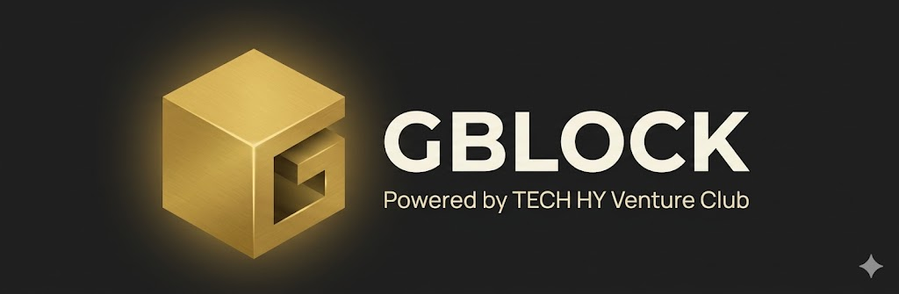

# GBlock Wiki

Public knowledge base for **GBlock — the B2B Private Market Space**, powered by
TECH HY Venture Club.

> _Where your reputation becomes your strongest asset._

<p align="center">
  
</p>

This repository is the long-form public guide for members, applicants, and
partners of GBlock. It explains what the club is, how access works, what each
role and status means, and how to move through the platform as a buyer, seller,
guarantor, or ambassador.

It does **not** contain source code, internal architecture, deployment, or
operational details. Those live in the private engineering workspace.

---

## Start here

If you are new to GBlock, read the sections in order. Each page is
self-contained, so you can also jump straight to the topic you need.

| # | Section | What you will learn |
|---|---|---|
| 1 | [What is GBlock](docs/01-what-is-gblock.md) | The product, the promise, what GBlock is **not**, and the rules of the space. |
| 2 | [User roles and statuses](docs/02-user-roles-and-statuses.md) | The three independent axes of membership: **Status**, **Trust Tier**, and **Reputation Tier**. The full access matrix. |
| 3 | [Getting access](docs/03-getting-access.md) | Invitation, magic link, ambassador self-registration, founding grant, community request. |
| 4 | [User journeys](docs/04-user-journeys.md) | Step-by-step flows: onboarding, browsing dealflow, placing a block, guaranteeing a member, deal threads, data room. |
| 5 | [Reputation economy](docs/05-reputation-economy.md) | Volume, Power, tier catalog, reward rates, how reputation grows and what it unlocks. |
| 6 | [Platform tour](docs/06-platform-tour.md) | Page-by-page walk-through of the member cabinet, with screenshots. |
| 7 | [Trust and safety](docs/07-trust-and-safety.md) | KYC, re-authentication, complaints, probation, device alerts, 2FA. |
| 8 | [Glossary](docs/08-glossary.md) | Plain-language definitions of every GBlock term. |
| 9 | [Roadmap and stage](docs/09-roadmap-and-stage.md) | Current stage, what is live, what is planned, what is explicitly out of scope. |

---

## Quick orientation

**GBlock is an invitation-only B2B private market club.** Members discover
private-market opportunities (primary raises, secondary blocks, pre-IPO, M&A,
OTC, institutional mandates), place their own sale blocks, request mediated
introductions, and build reputation through responsible behavior.

Access is earned, not bought. It is gated by reputation and operator review.
Every member has reputation at stake, and the person who invites or guarantees
you shares accountability for your conduct.

**What GBlock is not:**

- Not an exchange, broker/dealer, custodian, settlement agent, or investment advisor.
- Not a public marketplace. There is no "buy now" button.
- Not a crypto or token product. A "block" is a private package of assets or opportunities.
- No on-platform transactional settlement. No custody of assets. No promises of returns.

Read the full compliance boundary in
[What is GBlock](docs/01-what-is-gblock.md#what-gblock-is-not).

---

## Who this wiki is for

- **Applicants** deciding whether to request access.
- **New members** completing onboarding and learning the rules.
- **Active members** placing blocks, guaranteeing peers, or running deal threads.
- **Ambassadors** growing the community through invitations.
- **Partners and advisors** evaluating GBlock as a private-market surface.

---

## Platform

- **Public site:** <https://gblock.club>
- **Operator:** TECH HY SDN BHD
- **Dispute jurisdiction:** Courts of Kuala Lumpur, Malaysia
- **Community (access requests):** <https://t.me/TECH_HY_VC/6>
- **Contact:** `start@techhy.me`

---

## Repository contents

```text
.
├── README.md              ← this file, start here
├── docs/                  ← the guide, one topic per file
│   ├── 01-what-is-gblock.md
│   ├── 02-user-roles-and-statuses.md
│   ├── 03-getting-access.md
│   ├── 04-user-journeys.md
│   ├── 05-reputation-economy.md
│   ├── 06-platform-tour.md
│   ├── 07-trust-and-safety.md
│   ├── 08-glossary.md
│   └── 09-roadmap-and-stage.md
├── images/                ← platform screenshots used in the guide
└── brand/                 ← logo and brand reference assets
```

---

## Status of this document

GBlock is currently in the **PRE_MARKET_INTERNAL_UAT** stage: a controlled,
invitation-only, pre-market phase. Functionality described here reflects the
live product unless a section is explicitly marked as _planned_ or _roadmap_.

This wiki describes the member experience. It intentionally omits internal
architecture, source code, deployment, and operational procedures.

_Last updated: August 2026._
