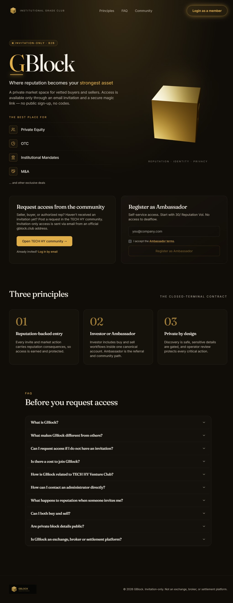
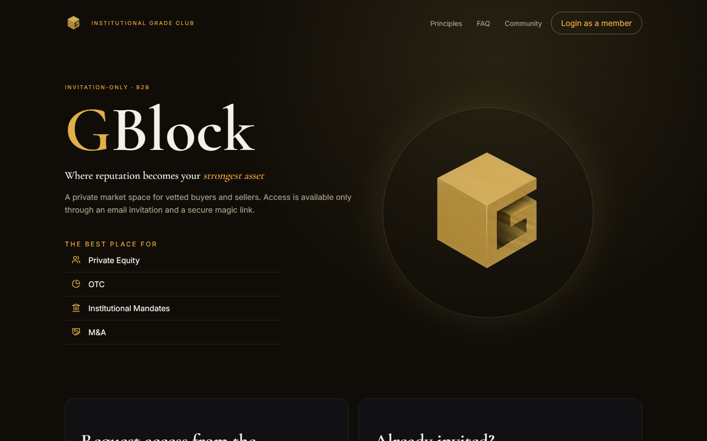

# 1. What is GBlock

GBlock is an **invitation-only B2B private market club** and the dealflow layer
of the TECH HY Venture Club ecosystem. It is a closed, reputation-governed
space where members discover private-market opportunities, place their own sale
blocks, request operator-mediated introductions, and build long-term reputation
through responsible conduct.

> _Where your reputation becomes your strongest asset._

  

---

## The promise

Private-market access becomes safer when every participant has reputation at
stake. GBlock turns that idea into a working model:

- **Access is earned, not bought.** Membership, dealflow, and listing rights
  are gated by reputation and operator review.
- **Reputation is shared.** The person who invites or guarantees you shares
  accountability for your conduct. Misbehavior costs both of you.
- **Identity is layered.** You can stay anonymous to the network while still
  transacting, or you can verify through KYC to unlock fuller access.
- **Introductions are mediated.** GBlock never hands you direct seller contact.
  Every connection passes through operator review.

The result is a quieter, more disciplined alternative to open deal boards: a
private terminal, not a public marketplace.

---

## What you can do in GBlock

| Role mode | What it means |
|---|---|
| **Buyer** | Browse the dealflow, review block previews, request access, express interest, and enter mediated deal threads. |
| **Seller** | Place sale blocks (a private package of assets or an opportunity), manage freshness, and review incoming access requests. |
| **Guarantor** | Stake reputation to vouch for another member and bring them into the Resident status or Vouched trust tier. |
| **Ambassador** | Grow the community by sending invitations and earning referral rewards. |

A single account holds all four modes. You are not a "buyer account" or a
"seller account"; you are a member who can act in any mode your status and trust
tier permit. See [User roles and statuses](02-user-roles-and-statuses.md).

---

## The three principles

The landing page frames the product around three commitments.

  

1. **Reputation is the currency.** Volume (long-term reputation) is the only
   thing that unlocks tier upgrades, higher reward rates, and faster operator
   service levels. It cannot be bought, only earned.
2. **Access is governed.** Nothing in the dealflow is public. Every block, every
   introduction, every data room grant is a deliberate, reviewable action.
3. **Accountability is shared.** Guarantors and inviters carry partial
   responsibility for the people they bring in. This is what keeps the network
   honest as it grows.

---

## What GBlock is not

This section exists because the private-market space is full of products that
promise things they cannot deliver. GBlock is deliberately narrower.

**GBlock is NOT:**

- An exchange, broker/dealer, custodian, settlement agent, or investment advisor.
- A public securities offering or a public marketplace.
- A crypto, token, or blockchain product. The word _block_ refers to a private
  package of assets or an opportunity, nothing more.
- A platform that settles transactions. GBlock arranges introductions; it does
  not move money or assets.
- A source of investment returns or profit promises.

**GBlock does NOT:**

- Hold custody of any asset, funds, or securities.
- Guarantee that any opportunity is available, fairly priced, allocated, or legal
  in your jurisdiction.
- Endorse the accuracy of seller-provided block information. Members must do
  their own diligence.
- Pay rewards from transaction volume. Monetary rewards, when applicable, are
  paid only from confirmed non-transactional TECH HY revenue.

If any communication from anyone claims GBlock offers guaranteed profit,
risk-free returns, passive income, or instant payouts, it is not from GBlock.
Report it through the in-platform complaint flow.

---

## The legal frame

| Item | Value |
|---|---|
| Operating entity | TECH HY SDN BHD |
| Endorsement | Powered by TECH HY Venture Club |
| Dispute jurisdiction | Courts of Kuala Lumpur, Malaysia |
| Public site | <https://gblock.club> |
| Contact | `start@techhy.me` |

Membership does not create an advisory, brokerage, or fiduciary relationship
between GBlock and any member. Members are responsible for their own decisions,
their own diligence, and their own compliance with the laws of their
jurisdiction.

---

## Where to go next

- **Understand who can do what:** [User roles and statuses](02-user-roles-and-statuses.md)
- **How to get in:** [Getting access](03-getting-access.md)
- **What the experience feels like:** [User journeys](04-user-journeys.md)
- **Definitions of every term used above:** [Glossary](08-glossary.md)
