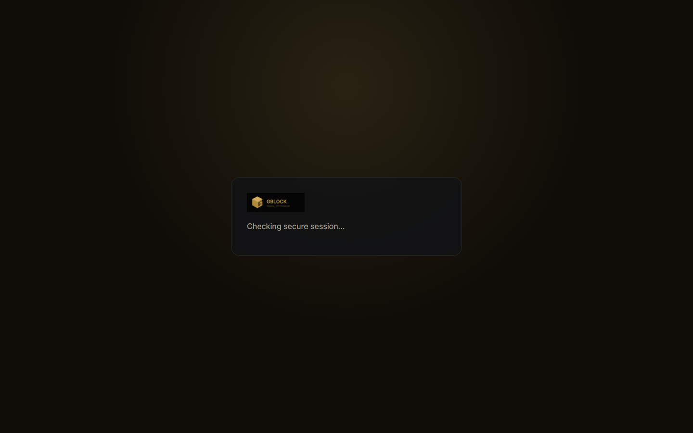
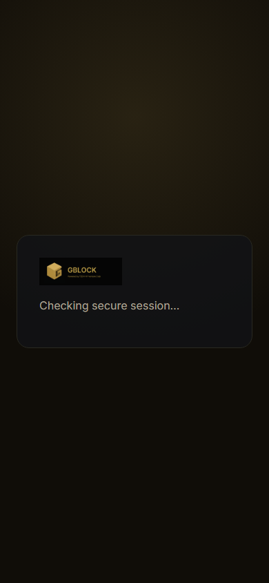
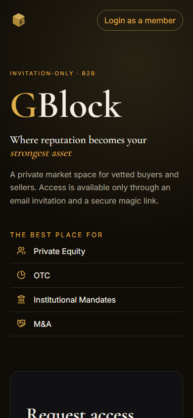

# 3. Getting access

GBlock is invitation-only. There is no open registration form that drops you
into the dealflow. This page lists every legitimate path in, how each one works,
and what to do if you do not have an invitation yet.

---

## The five paths into GBlock

| Path | Who it is for | What it gets you |
|---|---|---|
| **Member invitation** | People invited by an existing Resident or Ambassador | Registered status, onboarding |
| **Ambassador self-registration** | Community builders who want to grow the network | Ambassador status (invitations + referral rewards, no dealflow) |
| **Resident guarantee** | Existing members ready to enter dealflow | Resident status (dealflow, blocks, guarantees) |
| **Founding operator grant** | The bootstrap cohort, selected by the operator | Resident status, Verified Trust Tier, 14-day probation |
| **Community request** | Anyone without an invitation | A way to ask the community for one |

The first two are open to anyone who can reach them. The third requires you to
already be inside GBlock. The fourth is operator-driven and not openly
requestable. The fifth is the fallback if you have no contact inside.

---

## Path 1: Member invitation

This is the most common entry. An existing member with the right to invite
(Resident, Ambassador, or Ambassador-Resident) sends you an invitation by email.

**What happens:**

1. The inviter opens **Send Invite** in their cabinet and enters your email.
   The system reserves 10 Power from the inviter as a stake.
2. You receive an email with a magic link.
3. You click the link. GBlock verifies the token, consumes it (one-time use),
   and authenticates you.
4. If your profile is incomplete, you are sent to profile completion and then
   to market-interest selection. If your profile is already complete, you land
   in the cabinet.

**Important details:**

- The magic link is signed, single-use, and expires after 30 minutes.
- Login responses are generic on purpose. GBlock does not reveal whether an
  email is already registered, to prevent email enumeration.
- The inviter's staked Power is returned when your invitation activates or
  expires. If you misbehave, the inviter may face reputation impact.

  

  

---

## Path 2: Ambassador self-registration

If you want to help grow the community rather than (or in addition to)
participating in dealflow, you can apply to become an Ambassador directly from
the public landing page.

**What you get as Ambassador:**

- The right to send invitations.
- Referral attribution and reward eligibility when your invitees contribute.
- A starting Volume and Power floor of 30 / 30.

**What you do NOT get:**

- Ambassador status alone does **not** grant dealflow access. To see blocks,
  place blocks, or enter deal threads, you also need to become a Resident.

**How to apply:**

1. Open <https://gblock.club> and find the Ambassador section.
2. Review and accept the **Ambassador Terms**.
3. Submit the self-application. The operator reviews eligibility.
4. On approval, you receive a magic link and onboard as an Ambassador.

This path is suited to operators of communities, content creators, deal scouts,
and network builders who can reach relevant audiences.

---

## Path 3: Resident guarantee

If you are already inside GBlock as a Registered member or an Ambassador and
you want market access, you need a guarantee from an active Resident.

**How it works:**

1. Open the **Guarantee Board** in your cabinet and request a guarantee.
2. An active Resident accepts your request. They stake 10 Power as collateral,
   and you enter a 30-day probation period.
3. On successful completion of probation, your status becomes Resident and you
   gain dealflow, block, and guarantee rights.

A founding-grant Resident who has completed their 14-day probation can also act
as your guarantor.

Full mechanics, including what happens if you violate trust during probation,
are in [User journeys - Guarantee a member](04-user-journeys.md#guarantee-a-member)
and [Trust and safety - Probation](07-trust-and-safety.md#probation).

---

## Path 4: Founding operator grant

This is a bootstrap path used during the early growth phase. The operator
grants Resident status to a selected member with a recorded reason and
evidence.

- Limited to 50 grants, or until 100 active Residents exist.
- Founding Residents must pass KYC, so they enter as Verified Trust Tier.
- They serve a 14-day probation during which they cannot issue guarantees.
- After probation, they form the initial pool of Verified guarantors.

This path is not openly requestable. It is an operator decision tied to the
club's launch phase.

---

## Path 5: Community request

If you have no contact inside GBlock, you can ask the community directly.

1. Open <https://gblock.club> and use the **Request access from the community**
   link.
2. You are taken to the official TECH HY Venture Club community on Telegram:
   <https://t.me/TECH_HY_VC/6>.
3. Introduce yourself and your interest in private markets. If an existing
   member is willing to invite you, they will send you an invitation.

This path keeps GBlock invitation-only while still letting genuine applicants
find a sponsor. It is slower than a warm introduction, but it is the intended
route for applicants with no existing network inside the club.

  

---

## What happens after you get in

Regardless of which path brought you in, the first session follows the same
onboarding flow:

1. **Magic link consumption.** Click the link, get authenticated.
2. **Profile completion.** Fill in the details GBlock needs to operate. If your
   profile is already complete, this step is skipped.
3. **Market interests.** Pick the asset classes you care about (pre-IPO, private
   equity, OTC, secondary market, investment opportunities, other). These
   personalize discovery but never bypass access gates.
4. **Cabinet home.** You arrive at your member cabinet, where you see your
   reputation hero, trust tier badge, tier catalog position, standing, and
   quick actions.

From there, what you can do depends on your status and trust tier. See
[User roles and statuses](02-user-roles-and-statuses.md) and
[User journeys](04-user-journeys.md).

---

## A note on shared accountability

Every invitation and every guarantee carries shared responsibility. The person
who brought you in stakes reputation on your conduct. If you violate the rules
of the space, both you and your inviter or guarantor face reputation impact.
This is not a penalty for its own sake; it is the mechanism that lets GBlock
stay invitation-only and reputation-governed without a centralized gatekeeper
on every action.

Read the full conduct and enforcement model in
[Trust and safety](07-trust-and-safety.md).

---

## Where to go next

- **What each role can actually do:** [User roles and statuses](02-user-roles-and-statuses.md)
- **Step-by-step flows once you are inside:** [User journeys](04-user-journeys.md)
- **The numbers behind reputation:** [Reputation economy](05-reputation-economy.md)
