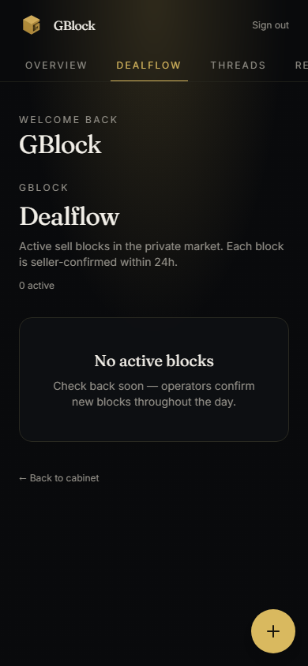
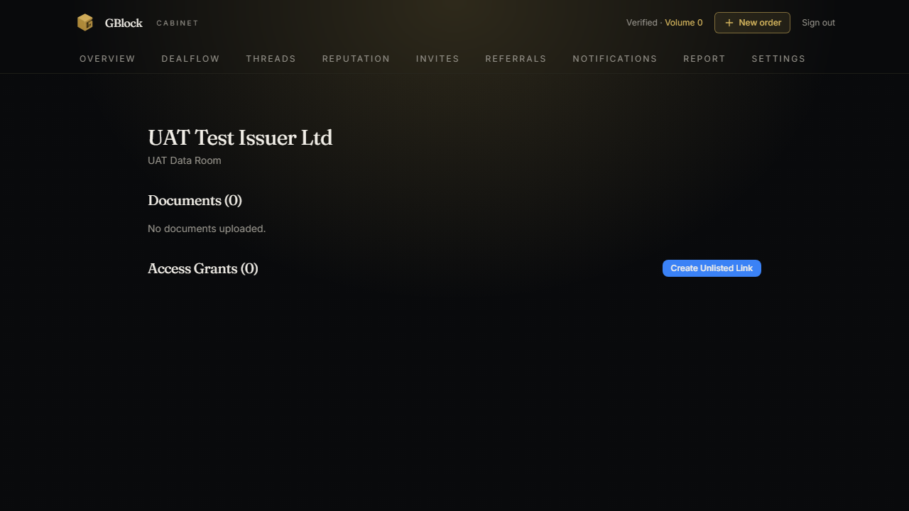

# 6. Platform tour

A page-by-page walk-through of what you see as a GBlock member. This tour
covers the public surfaces and the member cabinet. Screenshots are included
where the live UI is available; for surfaces still in pre-market validation,
the description is based on the platform specification.

---

## Public surfaces

These pages are visible to anyone, including guests who are not yet members.

### Landing

The front door of GBlock. It introduces the product, the three principles, the
compliance boundaries, and the paths to access.

  

The landing page offers three calls to action:

- **Request access from the community** (Telegram route for applicants without
  an invitation).
- **Register as Ambassador** (self-application for community builders).
- **FAQ** (the accordion of the most common questions).

  

### Magic link authentication

The login surface. You enter your email, receive a signed single-use link, and
click it to authenticate. The system gives the same response whether or not the
email is known, to prevent enumeration.

  

  

### Ambassador Terms

A standalone page describing the rights, obligations, and reward model for the
Ambassador status. You must accept these terms to self-register as an
Ambassador.

---

## Member cabinet

Everything below requires authentication. The cabinet is the daily home of an
active member.

### Cabinet home

The dashboard you land on after onboarding. It surfaces the things you need at
a glance:

- **Reputation hero:** your Volume, current Reputation Tier, reward rate, and
  progress toward the next tier.
- **Trust Tier badge:** Anonymous, Vouched, or Verified, so you always know
  which market actions you can take.
- **Tier Catalog:** your position in the canonical tier ladder and what the
  next tier requires.
- **Standing:** whether you are in good standing, on probation, or under any
  restriction.
- **Quick actions:** invite, dealflow, referrals, report.

  

### Profile and interests

- **Profile complete / edit:** the onboarding profile (identity details the
  operator needs to run the club). Required before you can act in the network.
- **Interests:** the asset classes you care about. Options include pre-IPO,
  private equity, OTC, secondary market, investment opportunities, and other.
  These personalize discovery but never bypass access gates.

### Reputation

The detailed reputation dashboard:

- Your **Volume** total and recent ledger events.
- Your current **grade** and **tier** in the catalog.
- Your **reward rate** and your **Power recharge schedule**.
- Progress toward the next tier.

This is where you inspect the numbers behind the [reputation economy](05-reputation-economy.md).

### Send Invite

The invitation surface. You enter an email, the system reserves 10 Power, and
the recipient receives a magic link. You should only invite people whose
conduct you can stand behind, because their behavior affects your reputation.

### Referrals

Referral reward candidates, each in one of these states:

- **Pending** (under review)
- **Locked** (held pending resolution)
- **Approved** (cleared for release)
- **Released** (paid out)
- **Suppressed** (held back due to a conduct or policy issue)

Rewards are paid only from confirmed non-transactional TECH HY revenue.

### Guarantee Board

Where you request, accept, or cancel guarantees. This is the hub for the shared
accountability system. Accepting a guarantee reserves 10 Power and starts a
probation period for the ward.

### Dealflow

The dealflow overview lists active sale blocks. Each card shows a safe preview.
Clicking a card opens the block detail page.

### Block detail

A safe, gated view of a single block. You see the preview and any terms the
seller has exposed. Two actions live here:

- **Request access:** ask the seller and operator to let you see more.
- **Express interest:** signal that you want a mediated introduction.

### Deal threads

Your mediated introduction channels, found under **Deals** and **Threads**.
Each deal has its own detail page with the message thread between you and the
counterparty. This is the governed channel for buyer-seller communication.

### Seller Dashboard

Your view as a seller. It lists your blocks across every lifecycle state and
gives you a path to create a new one.

- **Create Block:** the drafting form for a new sale block.
- **Seller block detail:** manage your own block. Renew (extend freshness) or
  close the block. Both actions require re-authentication.

### Data Room

The Virtual Data Room for a project you are representing. From here you:

- Upload diligence documents.
- Grant access (direct or unlisted token).
- Toggle download permissions.
- Revoke access.
- View the project's scoring report (Potential 0-150 + Readiness 0-150).

  

### Scoring report

A deterministic, two-axis evaluation of a project: **Potential** (0-150) and
**Readiness** (0-150). The report gives members a consistent way to compare
opportunities on the same dimensions.

### Notifications

Your activity feed. Expect alerts for:

- Probation start, end, and violation.
- Reputation updates and tier changes.
- Weekly reputation snapshots.
- Block freshness warnings.

### Report (complaints)

The safe complaint flow. You pick a type (abusive behavior, suspicious
activity, block quality issue, referral abuse, reputation dispute, marketplace
abuse, manual report) and submit. Evidence and operator notes stay internal;
your identity is not exposed to the subject of the complaint.

### Settings and 2FA

- **Settings:** account preferences.
- **2FA:** voluntary TOTP two-factor authentication. Enabling it adds a 0.1x
  reputation accrual bonus and strengthens account security. Enabling,
  verifying, and disabling 2FA all require re-authentication.

---

## Mobile experience

GBlock is built mobile-first. The cabinet and the public surfaces adapt to
small screens, so you can review dealflow, accept guarantees, and respond in
deal threads from a phone. Sensitive actions still require re-authentication
regardless of device.

  

---

## Read-only API (v1)

For members who want to integrate GBlock data into their own tools, a limited
read-only API is available. Endpoints cover session, profile, dashboard,
blocks, block detail, and deals. The API is read-only: it cannot place blocks,
send invitations, or modify reputation. Authentication follows the same
identity model as the cabinet.

> The API surface is intended for monitoring and personal tooling. Anything
> that mutates state must go through the cabinet, where re-authentication and
> operator review can apply.

---

## Where to go next

- **The rules behind what you see:** [User roles and statuses](02-user-roles-and-statuses.md)
- **Step-by-step flows on every page above:** [User journeys](04-user-journeys.md)
- **The security model behind the cabinet:** [Trust and safety](07-trust-and-safety.md)
